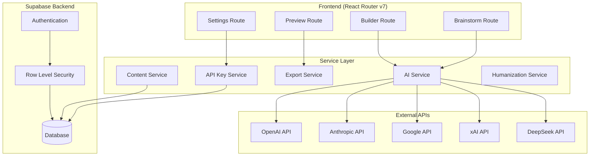

# Design Document

## Overview

This design transforms the Bestseller Author Pro platform from a demo implementation using mock data to a fully functional AI-powered ebook generation system. The platform leverages the existing architectural foundation with 5 AI providers (OpenAI, Anthropic, Google, xAI, DeepSeek), secure API key management via Supabase, and a complete React Router v7 workflow.

The core transformation involves replacing mock data with real AI API calls, implementing state persistence across the Brainstorm → Builder → Preview workflow, adding content storage to Supabase, and enhancing the export system for professional-quality output.

## Architecture

### High-Level Architecture



### Data Flow Architecture

The system follows a linear workflow with state persistence:

1. **Brainstorm Phase**: User provides topic → AI generates titles/outlines → Selection persisted
2. **Builder Phase**: User configures settings → AI generates complete ebook → Content stored
3. **Preview Phase**: User reviews content → Optional humanization → Export in multiple formats

### State Management Strategy

Using React Router v7's loader/action pattern for data flow:
- **Route Loaders**: Fetch persisted state and user data
- **Route Actions**: Handle form submissions and AI generation
- **Session Storage**: Temporary state during active workflow
- **Database Storage**: Permanent content and user data persistence

## Components and Interfaces

### Core Services

#### AI Service Enhancement
```typescript
interface AIService {
  // Existing methods enhanced
  generateContent(request: AIRequest): Promise<AIResponse>
  brainstorm(topic: string, provider: string, model: string, apiKey: string): Promise<BrainstormResult>
  
  // New methods for full workflow
  generateEbook(params: EbookGenerationParams): Promise<GeneratedEbook>
  generateChapter(params: ChapterParams): Promise<string>
  improveOutline(outline: string, provider: string, model: string, apiKey: string): Promise<string>
  humanizeContent(content: string, provider: string, model: string, apiKey: string): Promise<string>
}

interface BrainstormResult {
  titles: string[]
  outline: BookOutline
}

interface GeneratedEbook {
  id: string
  title: string
  subtitle?: string
  chapters: GeneratedChapter[]
  metadata: EbookMetadata
}
```

#### Content Service (New)
```typescript
interface ContentService {
  saveEbook(userId: string, ebook: GeneratedEbook): Promise<string>
  getEbook(userId: string, ebookId: string): Promise<GeneratedEbook | null>
  getUserEbooks(userId: string): Promise<EbookSummary[]>
  updateEbook(userId: string, ebookId: string, updates: Partial<GeneratedEbook>): Promise<void>
  deleteEbook(userId: string, ebookId: string): Promise<void>
}
```

#### Session Service (New)
```typescript
interface SessionService {
  saveBrainstormResult(sessionId: string, result: BrainstormResult): Promise<void>
  getBrainstormResult(sessionId: string): Promise<BrainstormResult | null>
  saveGenerationProgress(sessionId: string, progress: GenerationProgress): Promise<void>
  getGenerationProgress(sessionId: string): Promise<GenerationProgress | null>
  clearSession(sessionId: string): Promise<void>
}
```

### Route Enhancements

#### Brainstorm Route
- Replace mock data with real AI API calls
- Implement proper error handling and retry logic
- Add loading states with progress indicators
- Persist selected outline for Builder route

#### Builder Route
- Integrate with real AI generation
- Implement chunked content generation for large ebooks
- Add real-time progress tracking
- Handle generation interruption and resumption

#### Preview Route
- Load actual generated content from database
- Implement content editing capabilities
- Add humanization workflow
- Enhance export functionality

## Data Models

### Database Schema Extensions

```sql
-- Ebooks table for content storage
CREATE TABLE ebooks (
  id UUID PRIMARY KEY DEFAULT gen_random_uuid(),
  user_id UUID REFERENCES auth.users(id) ON DELETE CASCADE,
  title TEXT NOT NULL,
  subtitle TEXT,
  topic TEXT,
  word_count INTEGER,
  tone TEXT,
  audience TEXT,
  ai_provider TEXT,
  ai_model TEXT,
  status TEXT DEFAULT 'draft', -- draft, generating, completed, error
  created_at TIMESTAMP WITH TIME ZONE DEFAULT NOW(),
  updated_at TIMESTAMP WITH TIME ZONE DEFAULT NOW()
);

-- Chapters table for structured content
CREATE TABLE chapters (
  id UUID PRIMARY KEY DEFAULT gen_random_uuid(),
  ebook_id UUID REFERENCES ebooks(id) ON DELETE CASCADE,
  chapter_number INTEGER NOT NULL,
  title TEXT NOT NULL,
  content TEXT NOT NULL,
  word_count INTEGER,
  created_at TIMESTAMP WITH TIME ZONE DEFAULT NOW()
);

-- Generation sessions for workflow state
CREATE TABLE generation_sessions (
  id UUID PRIMARY KEY DEFAULT gen_random_uuid(),
  user_id UUID REFERENCES auth.users(id) ON DELETE CASCADE,
  brainstorm_data JSONB,
  builder_config JSONB,
  progress JSONB,
  status TEXT DEFAULT 'active', -- active, completed, expired
  expires_at TIMESTAMP WITH TIME ZONE DEFAULT (NOW() + INTERVAL '24 hours'),
  created_at TIMESTAMP WITH TIME ZONE DEFAULT NOW()
);

-- Row Level Security policies
ALTER TABLE ebooks ENABLE ROW LEVEL SECURITY;
ALTER TABLE chapters ENABLE ROW LEVEL SECURITY;
ALTER TABLE generation_sessions ENABLE ROW LEVEL SECURITY;

CREATE POLICY "Users can only access their own ebooks" ON ebooks
  FOR ALL USING (auth.uid() = user_id);

CREATE POLICY "Users can only access their own chapters" ON chapters
  FOR ALL USING (auth.uid() = (SELECT user_id FROM ebooks WHERE id = ebook_id));

CREATE POLICY "Users can only access their own sessions" ON generation_sessions
  FOR ALL USING (auth.uid() = user_id);
```

### TypeScript Interfaces

```typescript
interface EbookMetadata {
  wordCount: number
  chapterCount: number
  aiProvider: string
  aiModel: string
  tone: string
  audience: string
  createdAt: string
  updatedAt: string
}

interface GeneratedChapter {
  id: string
  number: number
  title: string
  content: string
  wordCount: number
}

interface GenerationProgress {
  phase: 'brainstorming' | 'outlining' | 'generating' | 'humanizing' | 'complete'
  currentChapter?: number
  totalChapters?: number
  percentage: number
  message: string
  startedAt: string
  estimatedCompletion?: string
}

interface EbookGenerationParams {
  topic: string
  wordCount: number
  tone: string
  customTone?: string
  audience: string
  outline?: string
  improveOutline: boolean
  provider: string
  model: string
  apiKey: string
}
```

## Correctness Properties

*A property is a characteristic or behavior that should hold true across all valid executions of a system—essentially, a formal statement about what the system should do. Properties serve as the bridge between human-readable specifications and machine-verifiable correctness guarantees.*

Before defining the correctness properties, I need to analyze the acceptance criteria from the requirements to determine which are testable as properties, examples, or edge cases.

### Property Reflection

After analyzing all acceptance criteria, I identified several areas where properties can be consolidated:

**Redundancy Analysis:**
- Properties 1.1, 1.2 can be combined into a comprehensive AI service integration property
- Properties 2.1, 2.2, 2.3 can be consolidated into a single state persistence property
- Properties 3.1, 3.2, 3.3 can be combined into a comprehensive data storage property
- Properties 5.1, 5.2, 5.3, 5.5 can be consolidated into a comprehensive error handling property
- Properties 6.1, 6.2, 6.3, 6.4, 6.5 can be combined into a comprehensive export property
- Properties 8.1, 8.2, 8.3 can be consolidated into a single humanization property

**Final Property Set:**
After consolidation, the following unique properties provide comprehensive validation coverage:

### Property 1: AI Service Integration
*For any* valid brainstorm or generation request with proper API keys, the AI service should successfully call the specified provider and model, returning generated content that matches the request parameters.
**Validates: Requirements 1.1, 1.2, 1.3**

### Property 2: API Key Validation and Error Handling
*For any* AI service request, if API keys are invalid or missing, the system should return descriptive error messages and appropriate redirects without making external API calls.
**Validates: Requirements 1.4, 5.1, 5.5**

### Property 3: Provider Fallback Mechanism
*For any* AI request with "auto" provider selection, when the primary provider fails, the system should attempt fallback providers in the correct preference order until success or all providers are exhausted.
**Validates: Requirements 1.5, 5.2, 5.3**

### Property 4: State Persistence Across Workflow
*For any* user session, data generated in one route (brainstorm results, builder configuration, generated content) should be available and intact when navigating to subsequent routes in the workflow.
**Validates: Requirements 2.1, 2.2, 2.3, 2.4**

### Property 5: Complete Data Storage and Retrieval
*For any* generated ebook, the system should store all content, metadata, and associated data in the database, and users should be able to retrieve all their ebooks with complete data integrity.
**Validates: Requirements 3.1, 3.2, 3.3, 3.5**

### Property 6: User Data Isolation
*For any* user, they should only be able to access, modify, or delete their own ebooks and associated data, with no access to other users' content.
**Validates: Requirements 3.4, 4.3**

### Property 7: Authentication and Session Management
*For any* user authentication action (login, logout, protected route access), the system should properly manage sessions, verify authentication status, and redirect appropriately.
**Validates: Requirements 4.2, 4.5**

### Property 8: Comprehensive Export Functionality
*For any* generated ebook, the system should be able to export it in all supported formats (PDF, EPUB, Markdown, HTML) with proper formatting, structure, and required elements (title pages, table of contents, copyright).
**Validates: Requirements 6.1, 6.2, 6.3, 6.4, 6.5**

### Property 9: Workflow Automation and Progress Tracking
*For any* ebook generation workflow, the system should automatically transition between phases, provide real-time progress updates, and handle workflow completion with appropriate navigation.
**Validates: Requirements 7.1, 7.2, 7.3, 7.4**

### Property 10: Content Humanization Process
*For any* AI-generated content, the humanization service should process it through all phases, remove AI clichés, add natural language patterns, and provide user control over accepting changes.
**Validates: Requirements 8.1, 8.2, 8.3, 8.4, 8.5**

### Property 11: Content Chunking for Large Ebooks
*For any* ebook generation request exceeding size thresholds, the system should process content in manageable chunks to prevent timeouts while maintaining content coherence.
**Validates: Requirements 9.2**

### Property 12: Caching and Performance Optimization
*For any* repeated AI requests with identical parameters, the system should utilize cached responses to improve performance and reduce API costs.
**Validates: Requirements 9.3, 9.4**

### Property 13: Security and Encryption
*For any* API key storage operation, the system should encrypt keys using AES-256-CBC encryption, and for any user input, the system should validate and sanitize data before processing.
**Validates: Requirements 10.1, 10.2, 10.3, 10.4**

## Error Handling

### Error Classification and Response Strategy

**API-Related Errors:**
- Invalid API keys → Redirect to settings with clear instructions
- Rate limiting → Show retry timing and suggest alternative providers
- Network failures → Provide retry buttons and fallback options
- Provider-specific errors → Attempt fallback providers in auto mode

**Data-Related Errors:**
- Database connection failures → Show maintenance message and retry options
- Data corruption → Attempt recovery and notify user of potential data loss
- Storage quota exceeded → Guide user to delete old content or upgrade

**User Input Errors:**
- Invalid form data → Show field-specific validation messages
- Missing required fields → Highlight required fields with clear labels
- File upload errors → Show supported formats and size limits

**System Errors:**
- Unexpected exceptions → Log detailed error information, show generic user message
- Memory/resource exhaustion → Graceful degradation with user notification
- Service unavailability → Show status page and estimated recovery time

### Error Recovery Mechanisms

**Automatic Recovery:**
- Retry transient failures with exponential backoff
- Attempt alternative AI providers when primary fails
- Resume interrupted generation from last successful checkpoint

**User-Initiated Recovery:**
- Manual retry buttons for failed operations
- Option to switch providers when encountering issues
- Ability to save partial progress and continue later

## Testing Strategy

### Dual Testing Approach

The system requires both unit testing and property-based testing for comprehensive coverage:

**Unit Tests** focus on:
- Specific examples of AI provider integration
- Edge cases in content generation (empty inputs, malformed data)
- Error conditions and recovery mechanisms
- Integration points between services
- Authentication and authorization flows

**Property-Based Tests** focus on:
- Universal properties that hold across all inputs
- Comprehensive input coverage through randomization
- State persistence across route navigation
- Data integrity and user isolation
- Export functionality across all formats

### Property-Based Testing Configuration

**Testing Framework:** Use `fast-check` for TypeScript property-based testing
**Test Configuration:** Minimum 100 iterations per property test
**Test Tagging:** Each property test must reference its design document property

**Example Property Test Structure:**
```typescript
// Feature: ai-powered-ebook-generation, Property 1: AI Service Integration
test('AI service integration with valid requests', () => {
  fc.assert(fc.property(
    fc.record({
      provider: fc.constantFrom('openai', 'anthropic', 'google', 'xai', 'deepseek'),
      model: fc.string(),
      prompt: fc.string({ minLength: 1 }),
      apiKey: fc.string({ minLength: 10 })
    }),
    async (request) => {
      const response = await aiService.generateContent(request);
      expect(response.provider).toBe(request.provider);
      expect(response.content).toBeDefined();
      expect(response.content.length).toBeGreaterThan(0);
    }
  ), { numRuns: 100 });
});
```

**Unit Test Balance:**
- Focus on specific examples and edge cases that demonstrate correct behavior
- Test integration points between AI service and external APIs
- Verify error handling for known failure scenarios
- Test authentication flows and session management
- Property tests handle comprehensive input coverage and universal correctness properties