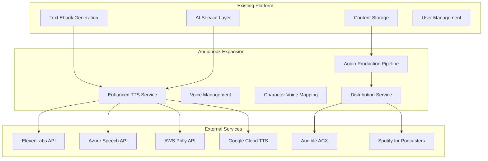

# Audiobook Expansion - Design Document

## Overview

This design extends Bestseller Author Pro's existing text ebook generation capabilities with comprehensive audiobook creation features. The expansion builds upon the current TTS service foundation to add professional-grade voice narration, multi-voice character support, advanced audio production, and distribution integration.

The design follows a modular architecture that maintains the existing platform's stability while adding new audiobook-specific capabilities. All new features integrate seamlessly with the current AI service layer, database schema, and user interface patterns.

## Architecture

### High-Level System Design



### Service Layer Architecture

The audiobook expansion extends the existing service architecture with new specialized services:

```typescript
interface AudiobookPlatform {
  // Existing services (enhanced)
  aiService: EnhancedAIService;
  contentService: ContentService;
  authService: AuthService;
  
  // New audiobook services
  enhancedTTSService: EnhancedTTSService;
  voiceManagementService: VoiceManagementService;
  audioProductionService: AudioProductionService;
  characterVoiceService: CharacterVoiceService;
  distributionService: DistributionService;
}
```

## Components and Interfaces

### Enhanced TTS Service

Extends the existing TTS service with advanced voice generation capabilities:

```typescript
interface EnhancedTTSService extends TTSService {
  // Voice cloning capabilities
  cloneVoice(audioSample: File, userId: string): Promise<VoiceProfile>;
  
  // Advanced voice generation
  generateWithEmotions(request: EmotionalTTSRequest): Promise<AudioResult>;
  
  // Batch processing for long content
  generateChaptersBatch(chapters: Chapter[], voiceProfile: VoiceProfile): Promise<AudioResult[]>;
  
  // Quality enhancement
  enhanceAudioQuality(audioUrl: string): Promise<AudioResult>;
}

interface EmotionalTTSRequest extends TTSRequest {
  emotion?: 'neutral' | 'happy' | 'sad' | 'excited' | 'calm' | 'dramatic';
  emphasis?: TextEmphasis[];
  pauseDuration?: number; // milliseconds
}

interface TextEmphasis {
  startIndex: number;
  endIndex: number;
  type: 'stress' | 'whisper' | 'shout' | 'pause';
}
```

### Voice Management Service

Manages voice profiles, cloning, and consistency:

```typescript
interface VoiceManagementService {
  // Voice profile management
  createVoiceProfile(params: VoiceCreationParams): Promise<VoiceProfile>;
  getVoiceProfiles(userId: string, provider?: string): Promise<VoiceProfile[]>;
  updateVoiceProfile(voiceId: string, updates: Partial<VoiceProfile>): Promise<void>;
  deleteVoiceProfile(voiceId: string, userId: string): Promise<void>;
  
  // Voice cloning
  initiateVoiceCloning(audioSample: File, metadata: VoiceMetadata): Promise<CloningJob>;
  getCloning JobStatus(jobId: string): Promise<CloningJobStatus>;
  
  // Voice testing and preview
  generateVoicePreview(voiceId: string, sampleText: string): Promise<AudioResult>;
  compareVoices(voiceIds: string[], sampleText: string): Promise<VoiceComparison>;
}

interface VoiceProfile {
  id: string;
  userId: string;
  provider: 'elevenlabs' | 'azure' | 'aws-polly' | 'google' | 'custom';
  voiceId: string;
  name: string;
  gender: 'male' | 'female' | 'neutral';
  ageRange: 'child' | 'young-adult' | 'adult' | 'elderly';
  accent: string;
  language: string;
  isCloned: boolean;
  originalSampleUrl?: string;
  characteristics: VoiceCharacteristics;
  qualityScore: number; // 1-10
  sampleUrl: string;
  createdAt: Date;
}

interface VoiceCharacteristics {
  pitch: 'very-low' | 'low' | 'medium' | 'high' | 'very-high';
  speed: 'very-slow' | 'slow' | 'medium' | 'fast' | 'very-fast';
  tone: 'warm' | 'neutral' | 'authoritative' | 'friendly' | 'dramatic';
  clarity: number; // 1-10
  naturalness: number; // 1-10
}
```

### Character Voice Service

Handles multi-voice support for fiction audiobooks:

```typescript
interface CharacterVoiceService {
  // Character detection and mapping
  detectCharacters(content: string): Promise<Character[]>;
  mapCharacterToVoice(characterId: string, voiceId: string, audiobookId: string): Promise<void>;
  
  // Dialogue processing
  parseDialogue(text: string): Promise<DialogueSegment[]>;
  assignVoicesToDialogue(segments: DialogueSegment[], characterVoices: CharacterVoiceMap): Promise<VoicedSegment[]>;
  
  // Voice consistency
  validateVoiceConsistency(audiobookId: string): Promise<ConsistencyReport>;
  suggestVoiceImprovements(characterId: string): Promise<VoiceSuggestion[]>;
}

interface Character {
  id: string;
  name: string;
  description: string;
  dialogueCount: number;
  suggestedVoiceCharacteristics: VoiceCharacteristics;
  firstAppearance: number; // chapter number
}

interface DialogueSegment {
  text: string;
  characterId?: string;
  isNarration: boolean;
  startIndex: number;
  endIndex: number;
  emotion?: string;
}

interface VoicedSegment extends DialogueSegment {
  voiceId: string;
  audioSettings: TTSRequest;
}

interface CharacterVoiceMap {
  [characterId: string]: string; // voiceId
}
```

### Audio Production Service

Handles professional audio editing and enhancement:

```typescript
interface AudioProductionService {
  // Chapter processing
  processChapterAudio(audioUrl: string, chapterMetadata: ChapterMetadata): Promise<ProcessedAudio>;
  
  // Audio enhancement
  normalizeAudioLevels(audioUrls: string[]): Promise<string[]>;
  removeAudioArtifacts(audioUrl: string): Promise<string>;
  addBackgroundMusic(audioUrl: string, musicTrack: string, volume: number): Promise<string>;
  
  // Chapter navigation
  addChapterMarkers(audioUrls: string[], chapters: Chapter[]): Promise<string>;
  generateIntroOutro(audiobookMetadata: AudiobookMetadata): Promise<IntroOutroAudio>;
  
  // Quality assurance
  analyzeAudioQuality(audioUrl: string): Promise<QualityReport>;
  validateAudioStandards(audioUrl: string, standard: 'audible' | 'spotify' | 'generic'): Promise<ValidationResult>;
}

interface ProcessedAudio {
  audioUrl: string;
  duration: number;
  fileSize: number;
  qualityScore: number;
  chapterMarkers: ChapterMarker[];
}

interface ChapterMarker {
  title: string;
  startTime: number; // seconds
  endTime: number;
}

interface QualityReport {
  overallScore: number; // 1-10
  issues: AudioIssue[];
  recommendations: string[];
  technicalSpecs: AudioSpecs;
}

interface AudioIssue {
  type: 'noise' | 'clipping' | 'silence' | 'volume' | 'quality';
  severity: 'low' | 'medium' | 'high';
  timestamp: number;
  description: string;
}
```

### Distribution Service

Manages export and platform integration:

```typescript
interface DistributionService {
  // Format export
  exportToAudibleACX(audiobookId: string): Promise<ACXExport>;
  exportToSpotify(audiobookId: string): Promise<SpotifyExport>;
  exportToGenericFormat(audiobookId: string, format: AudioFormat): Promise<GenericExport>;
  
  // Platform integration
  uploadToAudible(acxExport: ACXExport, credentials: AudibleCredentials): Promise<UploadResult>;
  uploadToSpotify(spotifyExport: SpotifyExport, credentials: SpotifyCredentials): Promise<UploadResult>;
  
  // Metadata generation
  generateAudiobookMetadata(audiobookId: string): Promise<AudiobookMetadata>;
  validateMetadata(metadata: AudiobookMetadata, platform: 'audible' | 'spotify'): Promise<ValidationResult>;
}

interface ACXExport {
  audioFiles: string[]; // URLs to chapter audio files
  metadata: ACXMetadata;
  coverImage: string;
  sampleAudio: string; // First 5 minutes
  totalDuration: number;
  fileSize: number;
}

interface AudiobookMetadata {
  title: string;
  author: string;
  narrator: string;
  description: string;
  genre: string[];
  language: string;
  isbn?: string;
  publishDate: Date;
  duration: number;
  chapters: ChapterMetadata[];
}
```

## Data Models

### Enhanced Database Schema

The audiobook expansion extends the existing database with new tables and enhanced existing ones:

```sql
-- Enhanced audiobooks table
ALTER TABLE audiobooks ADD COLUMN IF NOT EXISTS narrator_name TEXT;
ALTER TABLE audiobooks ADD COLUMN IF NOT EXISTS production_settings JSONB DEFAULT '{}';
ALTER TABLE audiobooks ADD COLUMN IF NOT EXISTS distribution_status JSONB DEFAULT '{}';
ALTER TABLE audiobooks ADD COLUMN IF NOT EXISTS quality_score DECIMAL(3,1);

-- Voice profiles table
CREATE TABLE voice_profiles (
  id UUID PRIMARY KEY DEFAULT gen_random_uuid(),
  user_id UUID REFERENCES auth.users(id) ON DELETE CASCADE,
  provider TEXT NOT NULL,
  voice_id TEXT NOT NULL,
  name TEXT NOT NULL,
  gender TEXT CHECK (gender IN ('male', 'female', 'neutral')),
  age_range TEXT CHECK (age_range IN ('child', 'young-adult', 'adult', 'elderly')),
  accent TEXT DEFAULT 'neutral',
  language TEXT DEFAULT 'en-US',
  is_cloned BOOLEAN DEFAULT false,
  original_sample_url TEXT,
  characteristics JSONB DEFAULT '{}',
  quality_score DECIMAL(3,1),
  sample_url TEXT,
  is_active BOOLEAN DEFAULT true,
  created_at TIMESTAMP WITH TIME ZONE DEFAULT NOW(),
  updated_at TIMESTAMP WITH TIME ZONE DEFAULT NOW()
);

-- Character voice mappings
CREATE TABLE character_voices (
  id UUID PRIMARY KEY DEFAULT gen_random_uuid(),
  audiobook_id UUID REFERENCES audiobooks(id) ON DELETE CASCADE,
  character_name TEXT NOT NULL,
  character_description TEXT,
  voice_profile_id UUID REFERENCES voice_profiles(id),
  dialogue_count INTEGER DEFAULT 0,
  first_appearance INTEGER, -- chapter number
  voice_settings JSONB DEFAULT '{}',
  created_at TIMESTAMP WITH TIME ZONE DEFAULT NOW()
);

-- Audio chapters with enhanced metadata
CREATE TABLE audio_chapters (
  id UUID PRIMARY KEY DEFAULT gen_random_uuid(),
  audiobook_id UUID REFERENCES audiobooks(id) ON DELETE CASCADE,
  chapter_number INTEGER NOT NULL,
  title TEXT NOT NULL,
  content_text TEXT,
  audio_url TEXT,
  duration INTEGER, -- seconds
  file_size BIGINT,
  voice_segments JSONB DEFAULT '[]', -- array of voice assignments
  chapter_markers JSONB DEFAULT '[]',
  quality_score DECIMAL(3,1),
  processing_status TEXT DEFAULT 'pending',
  created_at TIMESTAMP WITH TIME ZONE DEFAULT NOW(),
  updated_at TIMESTAMP WITH TIME ZONE DEFAULT NOW()
);

-- Voice cloning jobs
CREATE TABLE voice_cloning_jobs (
  id UUID PRIMARY KEY DEFAULT gen_random_uuid(),
  user_id UUID REFERENCES auth.users(id) ON DELETE CASCADE,
  provider TEXT NOT NULL,
  original_audio_url TEXT NOT NULL,
  voice_name TEXT NOT NULL,
  status TEXT DEFAULT 'pending' CHECK (status IN ('pending', 'processing', 'completed', 'failed')),
  progress_percentage INTEGER DEFAULT 0,
  result_voice_id TEXT,
  error_message TEXT,
  created_at TIMESTAMP WITH TIME ZONE DEFAULT NOW(),
  updated_at TIMESTAMP WITH TIME ZONE DEFAULT NOW()
);

-- Distribution exports
CREATE TABLE distribution_exports (
  id UUID PRIMARY KEY DEFAULT gen_random_uuid(),
  audiobook_id UUID REFERENCES audiobooks(id) ON DELETE CASCADE,
  platform TEXT NOT NULL CHECK (platform IN ('audible', 'spotify', 'generic')),
  export_format TEXT NOT NULL,
  export_url TEXT,
  metadata JSONB DEFAULT '{}',
  status TEXT DEFAULT 'pending' CHECK (status IN ('pending', 'processing', 'completed', 'failed')),
  created_at TIMESTAMP WITH TIME ZONE DEFAULT NOW()
);
```

## Correctness Properties

*A property is a characteristic or behavior that should hold true across all valid executions of a system—essentially, a formal statement about what the system should do. Properties serve as the bridge between human-readable specifications and machine-verifiable correctness guarantees.*

Now I need to analyze the acceptance criteria to determine which ones are testable as properties. Let me use the prework tool:

### Property Reflection

After analyzing all acceptance criteria, I identified several areas where properties can be consolidated for better testing efficiency:

**Consolidation Opportunities:**
- Properties 1.1, 4.2, and 4.3 all test API integration capabilities and can be combined into a comprehensive integration property
- Properties 1.4, 3.3 test consistency and can be combined into a general consistency property
- Properties 2.1, 2.4, and 4.4 all test content generation and can be combined into a content generation property
- Properties 4.1, 4.2, 4.3 test export/upload capabilities and can be combined into a distribution property

**Final Property Set:**
After consolidation, the following properties provide comprehensive coverage without redundancy:

### Correctness Properties

**Property 1: Multi-Provider Voice Integration**
*For any* supported AI voice provider (ElevenLabs, Azure Speech, AWS Polly, Google Cloud TTS), the system should successfully generate audio when provided with valid API credentials and text input
**Validates: Requirements 1.1, 4.2, 4.3**

**Property 2: Voice Diversity and Availability**
*For any* voice query request, the system should return at least 20 professional voice options with representation across male, female, and various accent categories
**Validates: Requirements 1.2**

**Property 3: Voice Cloning Round Trip**
*For any* valid audio sample provided by a user, the voice cloning process should create a new voice profile that can successfully generate speech matching the original voice characteristics
**Validates: Requirements 1.3**

**Property 4: Audio Consistency Preservation**
*For any* text content and voice profile, generating audio multiple times should produce consistent pronunciation, timing, and voice characteristics across all generations
**Validates: Requirements 1.4, 3.3**

**Property 5: Audio Production Enhancement**
*For any* raw audio input, the audio production pipeline should output enhanced audio with normalized levels, reduced artifacts, and optional background music integration
**Validates: Requirements 2.2, 2.3**

**Property 6: Automated Content Generation**
*For any* audiobook project, the system should automatically generate chapter breaks, navigation markers, and professional intro/outro segments with proper metadata
**Validates: Requirements 2.1, 2.4, 4.4**

**Property 7: Character Voice Management**
*For any* fiction text with dialogue, the system should detect characters, support assignment of up to 10 different voices, and allow manual override of automatic assignments
**Validates: Requirements 3.1, 3.2, 3.4**

**Property 8: Distribution Format Compliance**
*For any* completed audiobook, the export system should generate files that meet the technical specifications of target platforms (Audible ACX, Spotify for Podcasters)
**Validates: Requirements 4.1, 4.2, 4.3**

## Error Handling

### Voice Generation Errors

**API Failures:**
- Implement exponential backoff for rate-limited requests
- Provide fallback to alternative voice providers
- Cache successful generations to reduce API calls
- Display clear error messages for authentication failures

**Voice Cloning Errors:**
- Validate audio sample quality before processing
- Provide progress updates during long cloning operations
- Handle cloning failures with detailed error reporting
- Offer sample quality improvement suggestions

**Audio Quality Issues:**
- Detect and report audio artifacts automatically
- Provide quality scoring for generated audio
- Offer re-generation options for low-quality output
- Implement quality thresholds for automatic rejection

### Character Voice Errors

**Dialogue Detection Failures:**
- Provide manual dialogue marking tools
- Allow correction of automatic character detection
- Handle edge cases like nested dialogue and narration
- Support custom dialogue formatting patterns

**Voice Consistency Issues:**
- Monitor voice parameter drift across chapters
- Provide voice consistency validation tools
- Allow voice profile adjustments mid-project
- Implement voice similarity scoring

### Distribution Errors

**Export Format Issues:**
- Validate audio files against platform specifications
- Provide format conversion tools for compatibility
- Handle metadata validation failures gracefully
- Offer preview modes for export validation

**Platform Integration Failures:**
- Implement retry logic for upload failures
- Provide detailed upload progress tracking
- Handle authentication and permission errors
- Support manual export as fallback option

## Testing Strategy

### Dual Testing Approach

The audiobook expansion requires both unit testing and property-based testing to ensure comprehensive coverage:

**Unit Tests:**
- Test specific voice provider integrations with known inputs
- Validate audio processing algorithms with sample files
- Test character detection with predefined dialogue samples
- Verify export format generation with standard metadata
- Test error handling with simulated failure conditions

**Property-Based Tests:**
- Generate random text content for voice consistency testing
- Test voice cloning with various audio sample qualities
- Validate audio production with different input combinations
- Test character voice assignment with randomized dialogue
- Verify distribution exports with varied audiobook configurations

**Property Test Configuration:**
- Minimum 100 iterations per property test
- Each property test references its design document property
- Tag format: **Feature: audiobook-expansion, Property {number}: {property_text}**
- Use appropriate audio sample generators for realistic testing
- Implement audio quality metrics for automated validation

**Integration Testing:**
- End-to-end audiobook generation workflows
- Multi-provider voice service integration
- Platform upload and distribution testing
- Audio quality validation across different content types
- Performance testing with large audiobook projects

**Performance Testing:**
- Voice generation speed benchmarks
- Audio processing pipeline efficiency
- Concurrent audiobook generation capacity
- Memory usage during large file processing
- API rate limit handling and optimization

The testing strategy ensures that both individual components work correctly (unit tests) and that the system maintains correctness properties across all possible inputs (property tests), while integration tests validate the complete audiobook creation workflow.